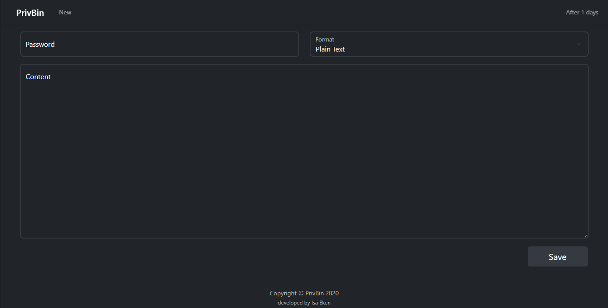

# PrivBin
   

> ### Store private or public temporary notes

-------



## Getting started

### Requirements
1. PHP >= 7.4|8.0
2. laravel/framework >= 8.12

### Installation
Clone the project using composer
````shell
composer create-project isaeken/privbin yourbinapp
````
Switch to project folder
````shell
cd yourbinapp
````
Install the project using composer
````shell
composer install
````
Edit environment (.env) file
````dotenv
APP_NAME="Your Project Name"
APP_ENV=production
APP_KEY=YOUR_AUTOMATICALLY_GENERATED_APP_KEY
APP_DEBUG=false
APP_URL=http://your_domain.local
APP_PASSWORD=SuperStrongPassword

DB_CONNECTION=mysql
DB_HOST=127.0.0.1
DB_PORT=3306
DB_DATABASE=database
DB_USERNAME=username
DB_PASSWORD=password
````
Install npm and compile assets
````shell
npm install && npm run prod
````
Fresh migrate your database
````shell
php artisan migrate:fresh
````
Start development server
````shell
php artisan serve --host=127.0.0.1 --port=8000
````

## Api
----

**Show Entry**
----
    Returns json data about a single entry.

*   **URL**
  
    /entry/:uuid/show
  
*   **Method:**
  
    `GET`

*   **URL Params**

    **Required:**

    `uuid=[string]`

    **Optional:**

    `password=[string]`

*   **Data Params**

    None

*   **Success Response:**

    *   **Code:** 200 <br />
        **Content:** `{ success: true, status: 200, response: { uuid: "b3bba783-d7e8-4b2e-9bc7-70250bc13f2d", state: "active", type: "plain_text", expires_at: "2020-12-19 19:24:48", content: "Hello World" } }`
        
*   **Error Response:**

    *   **Code:** 403 ACCESS DENIED <br />
    *   **Content:** `{ success: false, status: 403, response: { message: "Invalid password" } }`
    
    OR

    *   **Code:** 404 NOT FOUND <br />
    *   **Content:** `{ success: false, status: 404, response: { message: "Not Found" } }`

* **Sample Call:**

    ```javascript
    $.ajax({
        url: "/entry/b3bba783-d7e8-4b2e-9bc7-70250bc13f2d/show",
        dataType: "json",
        type: "GET",
        success: function(response) {
            console.log(response);
        }
    });
    ```

**Create Entry**
----
    Create and return json data about created entry.

*   **URL**

    /entry/store

*   **Method:**

    `POST`

*   **URL Params**

    None

*   **Data Params**

    **Required:**

    `expires=[minute_5|minute_15|minute_30|hour_1|hour_3|hour_6|day_1]`

    **Required:**

    `format=[plain_text|markdown]`

    **Required:**

    `content=[string]`

    **Optional:**

    `password=[string]`
    
*   **Success Response:**

    *   **Code:** 200 <br />
        **Content:** `{ success: true, status: 200, response: { uuid: "b3bba783-d7e8-4b2e-9bc7-70250bc13f2d", token: "b3bba783-d7e8-4b2e-9bc7-70250bc13f2d", state: "active", type: "plain_text", expires_at: "2020-12-19 19:24:48", content: "Hello World" } }`

*   **Error Response:**

    None
    
* **Sample Call:**

    ```javascript
    $.ajax({
        url: "/entry/store",
        dataType: "json",
        type: "POST",
        data: {
            expires: 'minute_5',
            format: 'plain_text',
            content: 'Hello World',
            password: 'very_secret',
        },
        success: function(response) {
            console.log(response);
        }
    });
    ```


**Delete Entry**
----
    Delete an entry.

*   **URL**

    /entry/:uuid/destroy

*   **Method:**

    `DELETE`

*   **URL Params**

    **Required:**

    `uuid=[string]`

*   **Data Params**
    
    **Required:**

    `token=[string]`

*   **Success Response:**

    *   **Code:** 200 <br />
        **Content:** `{ success: true, status: 200, response: null }`

*   **Error Response:**

    *   **Code:** 403 ACCESS DENIED <br />
    *   **Content:** `{ success: false, status: 403, response: { message: "Invalid token" } }`


* **Sample Call:**

    ```javascript
    $.ajax({
        url: "/entry/b3bba783-d7e8-4b2e-9bc7-70250bc13f2d/destroy",
        dataType: "json",
        type: "DELETE",
        data: {
            token: 'b3bba783-d7e8-4b2e-9bc7-70250bc13f2d'
        },
        success: function(response) {
            console.log(response);
        }
    });
    ```

## LICENSE

The MIT License (MIT)

Copyright 2020 İsa Eken

Permission is hereby granted, free of charge, to any person obtaining a copy of this software and associated documentation files (the "Software"), to deal in the Software without restriction, including without limitation the rights to use, copy, modify, merge, publish, distribute, sublicense, and/or sell copies of the Software, and to permit persons to whom the Software is furnished to do so, subject to the following conditions:

The above copyright notice and this permission notice shall be included in all copies or substantial portions of the Software.

THE SOFTWARE IS PROVIDED "AS IS", WITHOUT WARRANTY OF ANY KIND, EXPRESS OR IMPLIED, INCLUDING BUT NOT LIMITED TO THE WARRANTIES OF MERCHANTABILITY, FITNESS FOR A PARTICULAR PURPOSE AND NONINFRINGEMENT. IN NO EVENT SHALL THE AUTHORS OR COPYRIGHT HOLDERS BE LIABLE FOR ANY CLAIM, DAMAGES OR OTHER LIABILITY, WHETHER IN AN ACTION OF CONTRACT, TORT OR OTHERWISE, ARISING FROM, OUT OF OR IN CONNECTION WITH THE SOFTWARE OR THE USE OR OTHER DEALINGS IN THE SOFTWARE.
